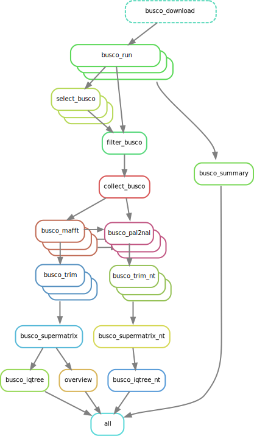

# uscophy


A workflow to extract BUSCO genes from assembled genomes and use them for a phylogenetic reconstruction.


# setup

To install this tool, we need to clone this repository to our local machine, create a conda environment with dependecies and then add the scripts to this environment. We recommend using miniforge to install conda (https://github.com/conda-forge/miniforge). Make sure to use the latest version in order to properly work together with snakemake. The location of the conda environment depends on your local setup. You can create an environment and specify a name, or you can specify a prefix to indicate the location of your environment. In this example we will place the environment inside the downloaded repository directory.

We can do this with the following commands.

```bash
git clone git@github.com:smrtin/uscophy.git
cd uscophy

# load a module to activate minforge.
# If minforge is installed globally skip the next line.
module load miniforge/24.7.1-0

mamba env create --prefix ./environment --file environment.yml 

# to run uscophy with the --snakemake option "--use-conda" we can only install a minimal environment, and the workflow will automatically install dependencies when needed.
#conda create --yes --prefix ./environment --channel bioconda --channel conda-forge snakemake mamba python==3.11

conda activate ./environment
```

After creating the conda environment, we want to install our tool into it. After activating the environment we have the package installer for Python (pip) available. We can now use pip to install uscophy from the local repository into the environment by running the following command:

```bash
pip install .
```

We should then be able to see the available options by entering:

```bash
uscophy --help

Usage: uscophy [OPTIONS] COMMAND [ARGS]...

Options:
  --help  Show this message and exit.

Commands:
  assemble
  build
  run
  
```

As input we need assembled genomic sequences in fasta files placed in the input directory. The files should carry the species or sample name and end with .fas . We can also provide a directory with transcriptome assemblies, which can be a supplement or an alternative dataset. 

```
uscophy run --help
Usage: uscophy run [OPTIONS]

Options:
  -g, --genomic TEXT              directory that contains all genome files
                                  with a .fas ending [ default: input ]
  -t, --transcriptomic TEXT       directory that contains all transcriptomic
                                  files with a .fas ending [ default:
                                  transcriptomes ]
  -l, --lineage TEXT              provide a busco lineage [ default:
                                  metazoa_odb10 ]
  -o, --output TEXT               directory that contains the busco sets [
                                  default: output ]
  -n, --num_taxa INTEGER          minimum number of taxa in alignment of the
                                  busco gene to be included in further
                                  analysis [ default: 5 ]
  -f, --frag                      also include fragmented busco genes
  -b, --best_duplicated           also include best duplicated sequencs. Most
                                  similar to the ancestral variants of the
                                  busco lineage.
  -m, --min_genes FLOAT           number of minimum busco genes per sample [
                                  default: 100 ]. When a number between 0 and
                                  1 is provided, it will be interpreted as
                                  percentage of the total number of genes
                                  available in the busco set.
  --alignment_software [mafft|hmmalign]
                                  choose an alignment software (mafft or
                                  hmmalign)  [default: mafft]
  --genetree                      also generate genetrees and reconstuct
                                  phylogeny with astral
  --modeltesting [JTT|TEST|MFP]   Modeltesting option for the tree
                                  reconstruction step (JTT, TEST, MFP)
                                  [default: JTT]
  --threads INTEGER               provide number of threads / cores / jobs
  -d, --dry                       Test execution.
  -s, --snakemake TEXT            additional snakemake options and command
  --category-csv PATH             Optional: Path to sample_category.csv.
  --min-taxa-per-category TEXT    Optional: Minimum taxa per category string,
                                  e.g. 'cat1:3,cat2:5'
  --outgroup TEXT                 Optional: Provide a Sample-ID that is used
                                  as an Outgroup in the final tree
  --help                          Show this message and exit.

  ```

In case we have some unassembled illumina short read data (e.g. from a genome skimming project ), we can use uscophy assemble to start the assembly process. We need to provide a list that contains the path to the paired end reads. We can prefilter reads for similarity to our reference busco genes and only assemble those (bioinformatic target enrichment step) or generate a de-novo assembly. In case we have a genome assembly of a closely related relative, we can use it to scaffold the contigs after the primary assembly.

```
uscophy assemble --help
Usage: uscophy assemble [OPTIONS]

Options:
  -l, --lineage TEXT              provide a busco lineage [ default:
                                  metazoa_odb10 ]
  -o, --output TEXT               directory that contains the busco sets [
                                  default: output ]
  --samples TEXT                  sample file with information about sample
                                  and read files  [required]
  -t, --threads INTEGER           provide number of threads / cores / jobs [
                                  default: 5 ]
  -a, --assembly_threads INTEGER  provide number of threads for each assembly
                                  step [ default: 10 ]
  -r, --ref_genome TEXT           provide a reference genome to scaffold
                                  fragmented assembly parts
  -d, --denovo                    Run denovo assembly from trimmed reads.
                                  Without prefiltering reads with diamond
  --dry                           Test execution.
  -s, --snakemake TEXT            additional snakemake options and command
  --help                          Show this message and exit.
                        Show this message and exit.
```

When we try to join different datasets or need a custom reference set that is not represented with the classic busco lineages, it is also possible to build a custom reference set that is usable with the busco software. This is still experimental and we recommend to try to use the busco lineages as a reference, also for comparabiliy and other reasons. As input we will need a directory containing the reference orthologous aminoacid sequences.

```
uscophy build --help
Usage: uscophy build [OPTIONS]

Options:
  -t, --threads INTEGER  provide number of threads / cores / jobs
  -d, --dry              Test execution.
  -i, --input TEXT       directory that contains all alignment files with a
                         .fas ending [ default: input ]
  -o, --output TEXT      directory that contains the busco sets [ default: ./
                         ]
  -n, --set_name TEXT    name your busco set [default: custom_set_odb10 ]
  -s, --snakemake TEXT   additional snakemake options and command
  --help                 Show this message and exit.
```

This project was previously developed here: https://gitlab.leibniz-lib.de/smartin/buscophy

## Example ##

Download sequneces from ncbi and change file name to species_name.fas and place in a directory: input_test 
We will download some Cirripedia genomes (currently 7 Genomes in a 2GB zip-file). 

Before starting the program activate the conda environment 


### Prepare a test Dataset ###

As an example dataset we can quickly download 9 Cirripedia genomes with the help of NCBIs datasets. This will be about 2GB in size. Then we can run a script that extracts the genomes from the zip-file and save them in a directory in .fas format, which we can use as input for our workflow.

```bash

conda activate ./environment

bash download_example_data.sh

```

This will also generate a category file in the output directory (input_test/samples_metadata.csv), which can be manually adjusted.

### Run first analysis ###
Now we can use the genome assemblies in our example input folder 'input_test' and start a dry run. With this we will get an overview about all the steps that will be processed. 
If everything looks ok, we can start the real run.
```bash

uscophy run    \
   --genomic input \
   --output output \
   --lineage metazoa_odb10    \
   --frag    \
   --alignment_software mafft    \
   --modeltesting TEST    \
   --threads 56 \
   --category-csv input_test/samples_metadata.csv
   
```

## snakemake arguments 
Since the we use snakemake inside the uscophy workflow, we can also make use of the available functionality. It is possible to pass snakemake arguments via the --snakemake option.

```bash
uscophy --input input_test/ --min_taxa 5 --lineage metazoa_odb10 --threads 56 --snakemake "--until busco_summary --printshellcmds"

```

To use uscophy in a cluster setting, we can add a plugin to snakemake into our conda environment, which enables the job submission to a resource management software (e.g. SGE, Slurm, ...)
```bash
conda install bioconda::snakemake-executor-plugin-cluster-generic
```
https://snakemake.github.io/snakemake-plugin-catalog/plugins/executor/cluster-generic.html


## graphical overview

A graphical overview about the main steps of the workflow can be seen here:



